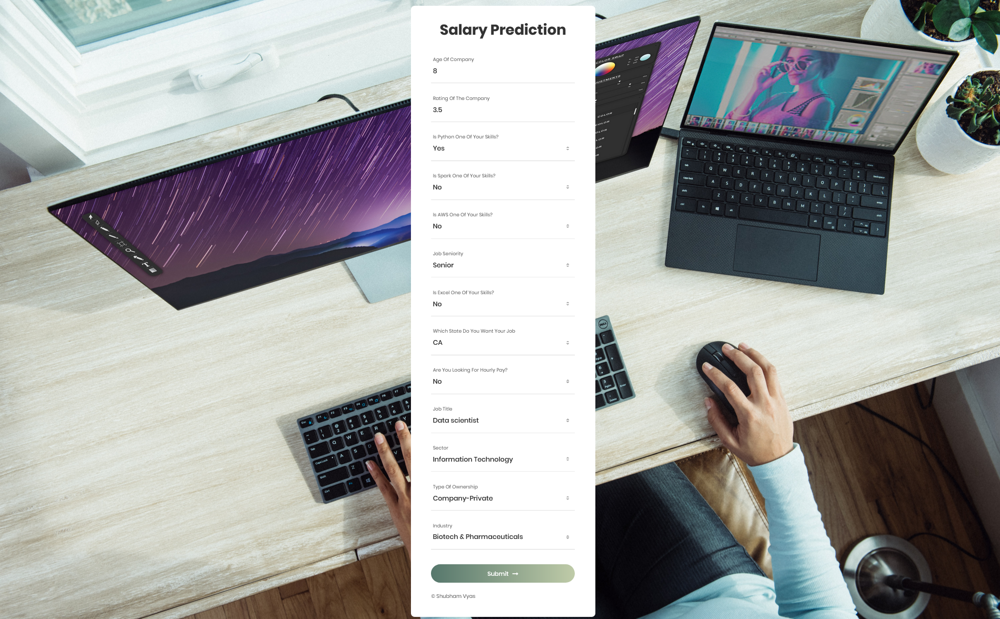

# salary-priceprediction_website
* Built a client facing API using Django and hosted the APP on Heroku.
* Model was trained with more parameters but the deployment of all parameters to heroku app will not be viable. So the model takes the input:
    * Age Of Company
    * Rating Of The Company (1-5)
    * Is Python One Of Your Skills?
    * Is Spark One Of Your Skills?
    * Is AWS One Of Your Skills?
    * Job Seniority
    * Is Excel One Of Your Skills?
    * Which State Do You Want Your Job
    * Are You Looking For Hourly Pay?
    * Job Title
    * Sector
    * Type Of Ownership
    * Industry
* This APP estimates data science salaries (Mean Absolute Error ~ $ 11K) to help data scientists negotiate their income when they get a job.

## Home
Takes the 13 Parameters mentioned above.

## Result
Salary is predicted by Random Forest Regressor with (_mean absolute error: 11.073154362416108_).

The predicted salary is in: (_$1000_).

